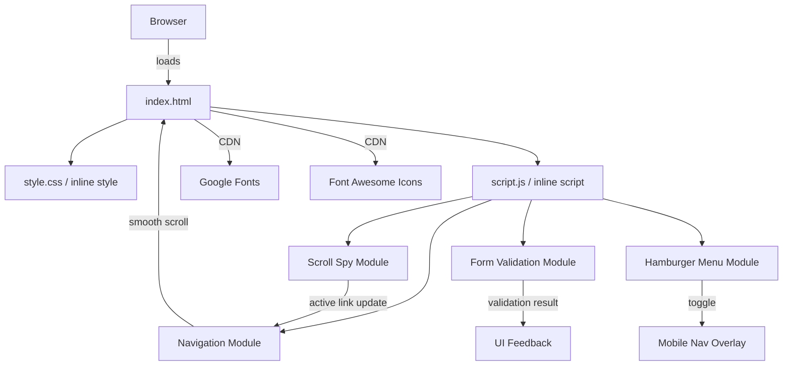
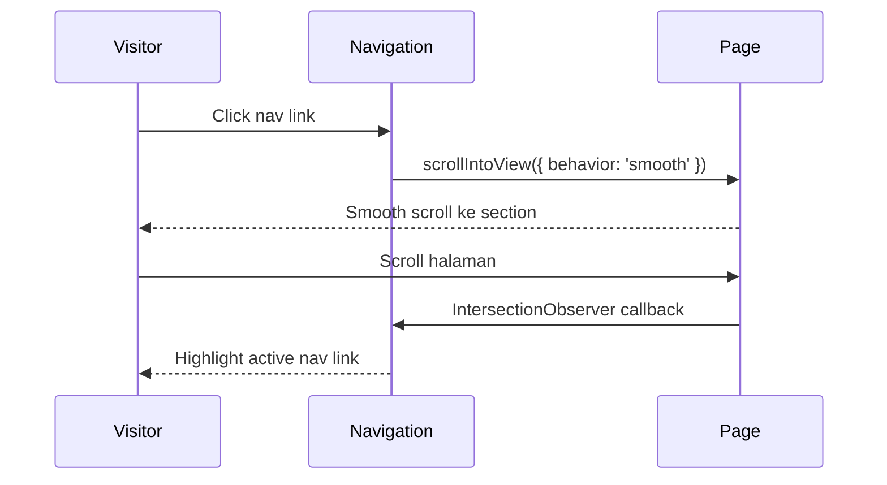
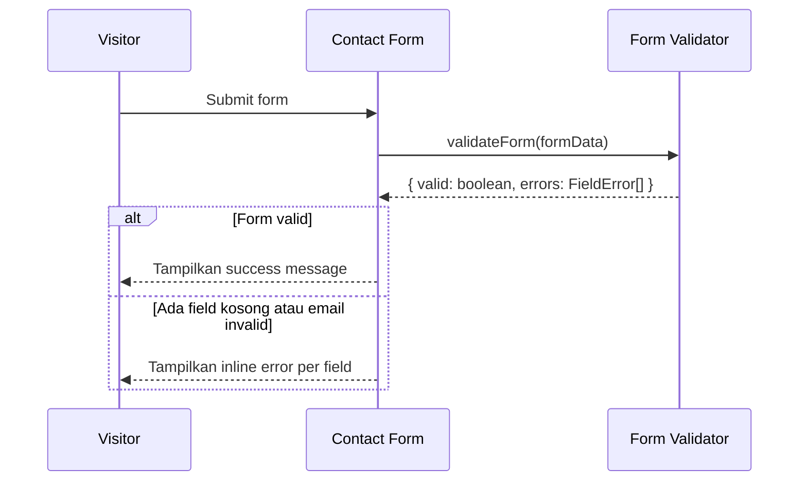

# Design Document — Personal Portfolio Web

## Overview

Halaman ini adalah *single-page portfolio* berbasis HTML, CSS, dan JavaScript vanilla untuk seorang Software Engineer dengan pengalaman 5 tahun di bidang cloud dan fintech. Tidak ada build tool atau package manager yang digunakan — semua aset dimuat melalui CDN atau file lokal.

**Tujuan utama:**
- Menampilkan identitas, pengalaman kerja, proyek pilihan, sertifikasi, dan informasi kontak dalam satu halaman yang mudah dinavigasi.
- Memberikan kesan profesional, modern, dan bersih melalui dark theme dengan neon accent cyan (`#00f5ff` atau serupa).
- Memastikan performa, aksesibilitas, dan responsivitas yang baik tanpa dependensi framework.

**Batasan teknis:**
- Satu file `index.html` yang menyertakan semua markup, styling (`<style>`), dan script (`<script>`), atau file terpisah `style.css` dan `script.js` yang direferensikan langsung tanpa bundler.
- Tidak ada JavaScript framework (React, Vue, Angular).
- Tidak ada package manager (npm, yarn, bun).
- Semua font dan icon dimuat dari CDN (Google Fonts, Font Awesome CDN).

---

## Architecture

Portofolio ini mengikuti arsitektur **static page** dengan pemisahan concern yang jelas:

```
index.html          ← markup utama, semantic HTML5
├── style.css       ← semua styling: CSS variables, layout, animasi, responsivitas
└── script.js       ← semua interaktivitas: navigasi, form validation, scroll spy
```

Atau semuanya disatukan dalam `index.html` menggunakan tag `<style>` dan `<script>` inline — pilihan ini valid selama total size ≤ 2MB.

### Pola Arsitektur



### Alur Navigasi



### Alur Form Validation



---

## Components and Interfaces

### 1. Navigation Component

**Tanggung jawab:** Sticky navbar, smooth scroll, active link highlighting, hamburger menu (mobile).

```
Navigation
├── .nav-container         (sticky header)
│   ├── .nav-brand         (nama/logo)
│   ├── .nav-links         (ul > li > a untuk tiap section)
│   └── .nav-hamburger     (button, tersembunyi di desktop)
└── .nav-mobile-overlay    (fullscreen menu, tersembunyi by default)
```

**Interface JavaScript:**
```javascript
// Inisialisasi scroll spy menggunakan IntersectionObserver
function initScrollSpy(sectionIds: string[]): void

// Toggle mobile nav overlay
function initHamburgerMenu(): void

// Smooth scroll ke target section
function smoothScrollTo(sectionId: string): void
```

**State:**
- `activeSection: string` — ID section yang sedang aktif di viewport

---

### 2. Hero Section Component

**Tanggung jawab:** Menampilkan identitas utama, bio, foto, dan CTA buttons dengan animasi saat page load.

```
HeroSection
├── .hero-photo            (img, rounded)
├── .hero-content
│   ├── h1.hero-name
│   ├── .hero-title        (subtitle/tagline)
│   ├── .hero-bio          (max 3 kalimat)
│   └── .hero-cta
│       ├── a.btn-primary  ("View My Work" → #projects)
│       └── a.btn-secondary("Contact Me" → #contact)
```

**Animasi:** CSS keyframes `fadeInUp` atau `slideUp` pada `.hero-name` dan `.hero-title`, `animation-duration: 500ms–700ms`.

---

### 3. Experience Section Component

**Tanggung jawab:** Menampilkan riwayat pekerjaan dalam urutan reverse chronological dengan layout timeline vertikal.

```
ExperienceSection
└── .experience-timeline
    └── .experience-entry (×N, diurutkan newest-first)
        ├── .entry-period      (start – end / Present)
        ├── .entry-company     (nama perusahaan)
        ├── .entry-title       (jabatan)
        └── .entry-description (ul > li × M)
```

**Data model:** Lihat bagian Data Models.

**Interaksi:** `:hover` pada `.experience-entry` memunculkan `border-left: 3px solid var(--neon-accent)`.

---

### 4. Projects Section Component

**Tanggung jawab:** Menampilkan project cards dalam responsive grid.

```
ProjectsSection
└── .projects-grid
    └── .project-card (×N)
        ├── .card-name         (nama proyek)
        ├── .card-description  (max 2 kalimat)
        ├── .card-tags         (span.tag × M)
        └── a.card-github      (href → GitHub URL, target="_blank")
```

**Interaksi:** `:hover` pada `.project-card` memunculkan `box-shadow: 0 0 20px var(--neon-accent)`.

**Grid responsif:**
- `≥ 768px`: `grid-template-columns: repeat(2, 1fr)` atau `repeat(3, 1fr)`
- `< 768px`: `grid-template-columns: 1fr`

---

### 5. Certifications Section Component

**Tanggung jawab:** Menampilkan certification badges dalam flex/grid layout.

```
CertificationsSection
└── .certifications-grid
    └── .certification-badge (×N)
        ├── .badge-name        (nama sertifikasi)
        ├── .badge-issuer      (nama organisasi penerbit)
        ├── .badge-year        (tahun terbit/pembaruan)
        └── a.badge-verify     (opsional, jika ada URL verifikasi, target="_blank")
```

**Interaksi:** `:hover` pada `.certification-badge` memunculkan `transform: scale(1.03)` dan `box-shadow: 0 0 12px var(--neon-accent)`.

---

### 6. Contact Section Component

**Tanggung jawab:** Menampilkan formulir kontak dengan validasi client-side dan social links.

```
ContactSection
├── .contact-form
│   ├── .form-group
│   │   ├── label (for="name")
│   │   ├── input#name[type="text"][required]
│   │   └── .error-message (tersembunyi, muncul saat error)
│   ├── .form-group
│   │   ├── label (for="email")
│   │   ├── input#email[type="email"][required]
│   │   └── .error-message
│   ├── .form-group
│   │   ├── label (for="message")
│   │   ├── textarea#message[required]
│   │   └── .error-message
│   ├── button[type="submit"]
│   └── .success-message (tersembunyi, muncul saat sukses)
└── .social-links
    ├── a[href=LinkedIn][target="_blank"][aria-label="LinkedIn Profile"]
    ├── a[href=Twitter/X][target="_blank"][aria-label="X (Twitter) Profile"]
    └── a[href=DEV Community][target="_blank"][aria-label="DEV Community Profile"]
```

**Interface JavaScript — Form Validator:**
```javascript
interface FieldError {
  field: 'name' | 'email' | 'message';
  message: string;
}

interface ValidationResult {
  valid: boolean;
  errors: FieldError[];
}

// Validasi semua field form
function validateForm(data: { name: string; email: string; message: string }): ValidationResult

// Validasi format email dengan regex
function isValidEmail(value: string): boolean

// Tampilkan error pada field tertentu
function showFieldError(fieldId: string, message: string): void

// Tampilkan success state
function showSuccessMessage(): void

// Bersihkan semua error state
function clearErrors(): void
```

---

## Data Models

### ExperienceEntry

```typescript
interface ExperienceEntry {
  id: string;                  // unique identifier, e.g. "exp-1"
  company: string;             // nama perusahaan
  title: string;               // jabatan
  startDate: string;           // format: "YYYY-MM" (e.g. "2022-01")
  endDate: string | null;      // null berarti "Present"
  responsibilities: string[];  // minimal 1 item
}
```

Contoh data (hardcoded di script.js atau langsung di HTML):
```javascript
const experiences = [
  {
    id: "exp-1",
    company: "Fintech Startup X",
    title: "Senior Software Engineer",
    startDate: "2022-01",
    endDate: null, // Present
    responsibilities: [
      "Merancang arsitektur microservices di AWS untuk payment gateway",
      "Memimpin tim 4 engineer untuk migrasi sistem monolitik ke cloud-native",
    ]
  },
  {
    id: "exp-2",
    company: "Cloud Solutions Y",
    title: "Software Engineer",
    startDate: "2019-06",
    endDate: "2021-12",
    responsibilities: [
      "Mengembangkan API RESTful dengan Go untuk sistem rekonsiliasi keuangan",
      "Mengimplementasikan CI/CD pipeline menggunakan GitHub Actions dan AWS ECS",
    ]
  }
];
```

### ProjectItem

```typescript
interface ProjectItem {
  id: string;
  name: string;
  description: string;       // maks 2 kalimat
  techTags: string[];        // e.g. ["Go", "AWS Lambda", "DynamoDB"]
  githubUrl: string;         // URL repository GitHub
}
```

### CertificationItem

```typescript
interface CertificationItem {
  id: string;
  name: string;              // e.g. "AWS Certified Solutions Architect – Associate"
  issuer: string;            // e.g. "Amazon Web Services"
  year: number;              // e.g. 2023
  verifyUrl?: string;        // opsional; jika ada, tampilkan link "Verify"
}
```

### FormData

```typescript
interface ContactFormData {
  name: string;
  email: string;
  message: string;
}

interface FieldError {
  field: keyof ContactFormData;
  message: string;
}

interface ValidationResult {
  valid: boolean;
  errors: FieldError[];
}
```

### CSS Theme Variables (`:root`)

```css
:root {
  /* Warna */
  --bg-primary:     #0d1117;   /* background utama, luminance < 15% */
  --bg-secondary:   #161b22;   /* background card/section alternate */
  --bg-card:        #1c2128;   /* background untuk card */
  --text-primary:   #e6edf3;   /* teks utama */
  --text-secondary: #8b949e;   /* teks sekunder/subtitle */
  --neon-accent:    #00f5ff;   /* cyan neon: hover, border, highlight */
  --neon-accent-dim:#00f5ff40; /* cyan dengan opacity rendah untuk glow */
  --border-color:   #30363d;   /* border halus */

  /* Tipografi */
  --font-heading:   'Space Grotesk', sans-serif;
  --font-body:      'Inter', sans-serif;
  --font-mono:      'JetBrains Mono', monospace;

  /* Spacing */
  --section-padding:      80px 0;
  --container-padding:    0 24px;
  --container-max-width:  1100px;

  /* Border radius */
  --radius-card:    8px;
  --radius-badge:   12px;
  --radius-button:  6px;

  /* Transisi */
  --transition-fast:   150ms ease;
  --transition-normal: 300ms ease;
}
```

---

## Correctness Properties

*A property is a characteristic or behavior that should hold true across all valid executions of a system — essentially, a formal statement about what the system should do. Properties serve as the bridge between human-readable specifications and machine-verifiable correctness guarantees.*

### Property 1: Active Navigation Link Matches Current Section

*For any* scroll position that falls within the bounds of a section, the corresponding navigation link for that section shall be the only link marked as active.

**Validates: Requirements 1.5**

---

### Property 2: Experience Entries Are Reverse Chronological

*For any* list of experience entries with distinct start dates, when rendered to the DOM, the entry with the most recent start date SHALL appear before entries with earlier start dates.

**Validates: Requirements 3.2**

---

### Property 3: Experience Entry Renders All Required Fields

*For any* valid `ExperienceEntry` object, the rendered HTML for that entry SHALL contain the company name, job title, employment period string, and at least one responsibility item.

**Validates: Requirements 3.3**

---

### Property 4: Project Card Renders All Required Fields

*For any* valid `ProjectItem` object, the rendered HTML for that card SHALL contain the project name, description text (of no more than two sentences), at least one technology tag, and an anchor element whose `href` is the GitHub URL and whose `target` is `"_blank"`.

**Validates: Requirements 4.3, 4.4**

---

### Property 5: Certification Badge Renders All Required Fields

*For any* valid `CertificationItem` object, the rendered HTML for that badge SHALL contain the certification name, issuing organization name, and the year as a visible text element.

**Validates: Requirements 5.3**

---

### Property 6: Certification Verify Link Is Conditional

*For any* `CertificationItem` whose `verifyUrl` property is a non-empty string, the rendered badge SHALL include an anchor element with `href` equal to that URL and `target="_blank"`. *For any* `CertificationItem` whose `verifyUrl` is absent or empty, no verify link SHALL be rendered.

**Validates: Requirements 5.4**

---

### Property 7: Form Validation Flags All Empty Required Fields

*For any* non-empty subset of `{name, email, message}` fields that are left empty upon form submission, the form SHALL display inline error messages for exactly those empty fields, and SHALL NOT display errors for fields that are correctly filled.

**Validates: Requirements 6.5**

---

### Property 8: Email Validation Rejects All Invalid Formats

*For any* string that does not conform to a valid email address format (i.e., does not match the pattern `localpart@domain.tld`), the form validation function SHALL return an error for the email field. *For any* string that IS a valid email address, the validation function SHALL NOT return an email format error.

**Validates: Requirements 6.6**

---

### Property 9: All Image Elements Have Non-Empty Alt Attributes

*For any* `` element present in the page HTML, the element SHALL have an `alt` attribute with a non-empty string value.

**Validates: Requirements 9.2**

---

### Property 10: Heading Hierarchy Is Sequential Without Skipping Levels

*For any* sequence of heading elements (`<h1>` through `<h4>`) in the document, the heading level of any heading SHALL NOT exceed the previous heading's level by more than 1 (i.e., no level-skipping downward such as `<h1>` directly followed by `<h3>`).

**Validates: Requirements 9.6**

---

## Error Handling

### Form Validation Errors

Semua error validasi form bersifat client-side dan ditangani tanpa page refresh.

| Kondisi | Pesan Error | Lokasi Tampil |
|---|---|---|
| Field name kosong | "Name is required." | Di bawah input name |
| Field email kosong | "Email is required." | Di bawah input email |
| Format email invalid | "Please enter a valid email address." | Di bawah input email |
| Field message kosong | "Message is required." | Di bawah textarea |

**Mekanisme:**
- Elemen `.error-message` ada di HTML untuk setiap field, tersembunyi secara default (`display: none` atau `visibility: hidden`).
- Saat validasi gagal, JS menambahkan class `.error-active` pada `.form-group` dan mengisi teks `.error-message`.
- Saat submit berhasil, semua error dibersihkan dan `.success-message` ditampilkan.
- Form **tidak** melakukan submit ke server (tidak ada backend); kesuksesan adalah state UI saja.

### Aset Gagal Dimuat (CDN)

Jika font CDN gagal dimuat (koneksi offline), browser fallback ke font system default yang didefinisikan dalam `font-family` stack:
```css
--font-heading: 'Space Grotesk', system-ui, -apple-system, sans-serif;
--font-body:    'Inter', system-ui, -apple-system, sans-serif;
--font-mono:    'JetBrains Mono', 'Courier New', monospace;
```

Jika icon CDN (Font Awesome) gagal, icon diganti dengan teks label yang sudah ada di atribut `aria-label` dan atribut `title` pada elemen.

### Gambar Tidak Ditemukan

Foto profil di Hero Section menggunakan fallback placeholder (SVG inline atau warna solid dengan inisial nama) jika sumber gambar tidak dapat dimuat, ditangani dengan event handler `onerror`:
```html

```

### IntersectionObserver Tidak Didukung

Jika browser tidak mendukung `IntersectionObserver` (browser lama), scroll spy tidak aktif — nav link tidak akan di-highlight secara otomatis. Navigasi tetap berfungsi normal. Deteksi:
```javascript
if ('IntersectionObserver' in window) {
  initScrollSpy(sectionIds);
}
```

---

## Testing Strategy

### Pendekatan Pengujian

Portofolio ini menggunakan dua pendekatan pengujian yang saling melengkapi:

1. **Unit Tests (Example-Based)**: Memverifikasi perilaku spesifik dengan input konkret.
2. **Property-Based Tests (PBT)**: Memverifikasi properti universal yang harus berlaku untuk semua input valid.

Kedua jenis tes bersifat komplementer — unit test menangkap bug konkret, property test memverifikasi kebenaran umum.

### Stack Pengujian

- **Test runner**: [Vitest](https://vitest.dev/) — ringan, tanpa config kompleks, cocok untuk proyek tanpa bundler (bisa dijalankan langsung dengan `vitest --run`).
- **Property-based testing library**: [fast-check](https://fast-check.dev/) — library PBT untuk JavaScript/TypeScript.
- **DOM testing**: [jsdom](https://github.com/jsdom/jsdom) (via Vitest environment) untuk mengetes struktur HTML dan interaksi form.

> **Catatan**: Karena portofolio adalah static page tanpa build tool untuk produksi, test runner (Vitest + fast-check) hanya diinstal sebagai development dependency menggunakan `devDependencies` dan tidak mempengaruhi output produksi.

### Property-Based Tests

Setiap property test menggunakan minimum **100 iterasi** dan diberi tag referensi ke properti desain yang divalidasi.

**Format tag:**
```
// Feature: personal-portfolio-web, Property N: <property_text>
```

#### Property 1 — Active Nav Link Matches Section

```javascript
// Feature: personal-portfolio-web, Property 1: Active nav link matches current section
test('active nav link corresponds to section containing scroll position', () => {
  fc.assert(fc.property(
    fc.constantFrom('hero', 'experience', 'projects', 'certifications', 'contact'),
    fc.integer({ min: 0, max: 9999 }),
    (sectionId, scrollY) => {
      // Setup: mock section bounds such that scrollY falls within sectionId
      const activeLink = getActiveLinkForScrollPosition(scrollY, mockedSectionBounds(sectionId, scrollY));
      return activeLink === sectionId;
    }
  ), { numRuns: 100 });
});
```

#### Property 2 — Experience Reverse Chronological Order

```javascript
// Feature: personal-portfolio-web, Property 2: Experience entries rendered in reverse chronological order
test('experience entries are always sorted newest-first', () => {
  fc.assert(fc.property(
    fc.array(fc.record({
      id: fc.string(),
      company: fc.string({ minLength: 1 }),
      title: fc.string({ minLength: 1 }),
      startDate: fc.date({ min: new Date('2010-01'), max: new Date('2024-12') })
                  .map(d => `${d.getFullYear()}-${String(d.getMonth()+1).padStart(2,'0')}`),
      endDate: fc.option(fc.string()),
      responsibilities: fc.array(fc.string({ minLength: 1 }), { minLength: 1 })
    }), { minLength: 1 }),
    (entries) => {
      const sorted = sortExperienceEntries(entries);
      for (let i = 0; i < sorted.length - 1; i++) {
        expect(sorted[i].startDate >= sorted[i+1].startDate).toBe(true);
      }
    }
  ), { numRuns: 100 });
});
```

#### Property 3 — Experience Entry HTML Completeness

```javascript
// Feature: personal-portfolio-web, Property 3: Experience entry renders all required fields
test('any valid experience entry renders with all required fields', () => {
  fc.assert(fc.property(
    fc.record({
      id: fc.string(),
      company: fc.string({ minLength: 1 }),
      title: fc.string({ minLength: 1 }),
      startDate: fc.constant('2022-01'),
      endDate: fc.option(fc.constant('2023-12')),
      responsibilities: fc.array(fc.string({ minLength: 1 }), { minLength: 1 })
    }),
    (entry) => {
      const html = renderExperienceEntry(entry);
      expect(html).toContain(entry.company);
      expect(html).toContain(entry.title);
      expect(html).toContain(entry.startDate.replace('-', '/') || entry.startDate);
      expect(html).toContain(entry.responsibilities[0]);
    }
  ), { numRuns: 100 });
});
```

#### Property 4 — Project Card HTML Completeness

```javascript
// Feature: personal-portfolio-web, Property 4: Project card renders all required fields
test('any valid project item renders with all required fields and correct GitHub link', () => {
  fc.assert(fc.property(
    fc.record({
      id: fc.string(),
      name: fc.string({ minLength: 1 }),
      description: fc.string({ minLength: 1 }),
      techTags: fc.array(fc.string({ minLength: 1 }), { minLength: 1 }),
      githubUrl: fc.webUrl()
    }),
    (project) => {
      const html = renderProjectCard(project);
      expect(html).toContain(project.name);
      expect(html).toContain(project.description);
      expect(html).toContain(project.techTags[0]);
      expect(html).toContain(`href="${project.githubUrl}"`);
      expect(html).toContain('target="_blank"');
    }
  ), { numRuns: 100 });
});
```

#### Property 5 — Certification Badge HTML Completeness

```javascript
// Feature: personal-portfolio-web, Property 5: Certification badge renders all required fields
test('any valid certification item renders with all required fields', () => {
  fc.assert(fc.property(
    fc.record({
      id: fc.string(),
      name: fc.string({ minLength: 1 }),
      issuer: fc.string({ minLength: 1 }),
      year: fc.integer({ min: 2000, max: 2030 })
    }),
    (cert) => {
      const html = renderCertificationBadge(cert);
      expect(html).toContain(cert.name);
      expect(html).toContain(cert.issuer);
      expect(html).toContain(String(cert.year));
    }
  ), { numRuns: 100 });
});
```

#### Property 6 — Certification Verify Link Is Conditional

```javascript
// Feature: personal-portfolio-web, Property 6: Certification verify link is conditional on verifyUrl
test('certification with verifyUrl has verify link; without verifyUrl has none', () => {
  fc.assert(fc.property(
    fc.record({
      id: fc.string(),
      name: fc.string({ minLength: 1 }),
      issuer: fc.string({ minLength: 1 }),
      year: fc.integer({ min: 2000, max: 2030 }),
      verifyUrl: fc.option(fc.webUrl(), { nil: undefined })
    }),
    (cert) => {
      const html = renderCertificationBadge(cert);
      if (cert.verifyUrl) {
        expect(html).toContain(`href="${cert.verifyUrl}"`);
        expect(html).toContain('target="_blank"');
      } else {
        expect(html).not.toContain('Verify');
      }
    }
  ), { numRuns: 100 });
});
```

#### Property 7 — Form Validates All Empty Required Fields

```javascript
// Feature: personal-portfolio-web, Property 7: Form validation flags all empty required fields
test('any non-empty subset of empty required fields produces matching errors', () => {
  fc.assert(fc.property(
    fc.record({
      name: fc.oneof(fc.constant(''), fc.string({ minLength: 1 })),
      email: fc.oneof(fc.constant(''), fc.emailAddress()),
      message: fc.oneof(fc.constant(''), fc.string({ minLength: 1 }))
    }),
    (formData) => {
      const result = validateForm(formData);
      const emptyFields = Object.entries(formData)
        .filter(([, v]) => v === '')
        .map(([k]) => k);

      if (emptyFields.length > 0) {
        expect(result.valid).toBe(false);
        emptyFields.forEach(field => {
          expect(result.errors.some(e => e.field === field)).toBe(true);
        });
      }

      // Non-empty fields should not have "required" errors
      const filledFields = Object.entries(formData)
        .filter(([, v]) => v !== '')
        .map(([k]) => k);
      filledFields.forEach(field => {
        const hasRequiredError = result.errors.some(
          e => e.field === field && e.message.includes('required')
        );
        expect(hasRequiredError).toBe(false);
      });
    }
  ), { numRuns: 200 });
});
```

#### Property 8 — Email Validation Rejects Invalid Formats

```javascript
// Feature: personal-portfolio-web, Property 8: Email validation rejects all invalid formats
test('isValidEmail returns false for all non-email strings and true for all valid emails', () => {
  // Test invalid emails
  fc.assert(fc.property(
    fc.string().filter(s => !s.includes('@') || s.startsWith('@') || s.endsWith('@')),
    (invalidEmail) => {
      expect(isValidEmail(invalidEmail)).toBe(false);
    }
  ), { numRuns: 100 });

  // Test valid emails
  fc.assert(fc.property(
    fc.emailAddress(),
    (validEmail) => {
      expect(isValidEmail(validEmail)).toBe(true);
    }
  ), { numRuns: 100 });
});
```

#### Property 9 — All Images Have Non-Empty Alt Attributes

```javascript
// Feature: personal-portfolio-web, Property 9: All img elements have non-empty alt attributes
test('every img element in the page has a non-empty alt attribute', () => {
  const dom = new JSDOM(fs.readFileSync('index.html', 'utf-8'));
  const images = dom.window.document.querySelectorAll('img');
  images.forEach(img => {
    expect(img.hasAttribute('alt')).toBe(true);
    expect(img.getAttribute('alt').trim().length).toBeGreaterThan(0);
  });
});
```

#### Property 10 — Heading Hierarchy Is Sequential

```javascript
// Feature: personal-portfolio-web, Property 10: Heading hierarchy never skips levels downward
test('heading levels in the document never skip more than one level downward', () => {
  const dom = new JSDOM(fs.readFileSync('index.html', 'utf-8'));
  const headings = Array.from(dom.window.document.querySelectorAll('h1,h2,h3,h4'));
  const levels = headings.map(h => parseInt(h.tagName[1]));

  for (let i = 0; i < levels.length - 1; i++) {
    const diff = levels[i+1] - levels[i];
    // Level boleh naik bebas (h3→h1 ok), tapi tidak boleh lompat turun (h1→h3 tidak ok)
    expect(diff).toBeLessThanOrEqual(1);
  }
});
```

---

### Unit Tests (Example-Based)

Unit test berikut melengkapi property tests dengan skenario konkret:

| Test | Target | Deskripsi |
|---|---|---|
| `nav-links.test.js` | Navigation | Verifikasi 5 nav links ada dan `href` cocok dengan section ID |
| `smooth-scroll.test.js` | Navigation | Klik nav link memanggil `scrollIntoView` dengan `behavior: 'smooth'` |
| `hamburger.test.js` | Mobile Nav | Toggle hamburger menambah/hapus class `open` pada overlay |
| `hero-cta.test.js` | Hero Section | Button "View My Work" dan "Contact Me" mengarah ke section yang benar |
| `form-submit-success.test.js` | Contact Form | Submit dengan semua field valid menampilkan `.success-message` |
| `form-submit-empty.test.js` | Contact Form | Submit form kosong menampilkan error pada semua tiga field |
| `social-links.test.js` | Contact Section | Tiga social links ada dan memiliki `target="_blank"` |
| `section-order.test.js` | Page Structure | Urutan section sesuai spec: hero, experience, projects, certifications, contact |
| `experience-count.test.js` | Experience | Minimal 2 entry pengalaman kerja ada di DOM |
| `projects-count.test.js` | Projects | Minimal 3 project cards ada di DOM |
| `certifications-count.test.js` | Certifications | Minimal 2 certification badges ada di DOM |

### Integration / Smoke Tests

| Test | Tool | Deskripsi |
|---|---|---|
| Lighthouse Performance ≥ 80 | Lighthouse CLI | `lighthouse http://localhost:PORT --output json` |
| Lighthouse Accessibility ≥ 90 | Lighthouse CLI | Termasuk WCAG 2.1 AA color contrast |
| Cross-browser rendering | Browser DevTools / BrowserStack | Chrome, Firefox, Safari, Edge — latest stable |
| Page weight ≤ 2MB | Chrome DevTools Network | Cold load total transfer size |
| Keyboard navigation | Manual / axe | Tab melalui semua interactive elements tanpa mouse |
| Responsive layout | Chrome DevTools Device Mode | 320px, 768px, 1440px, 2560px — no horizontal scroll |
